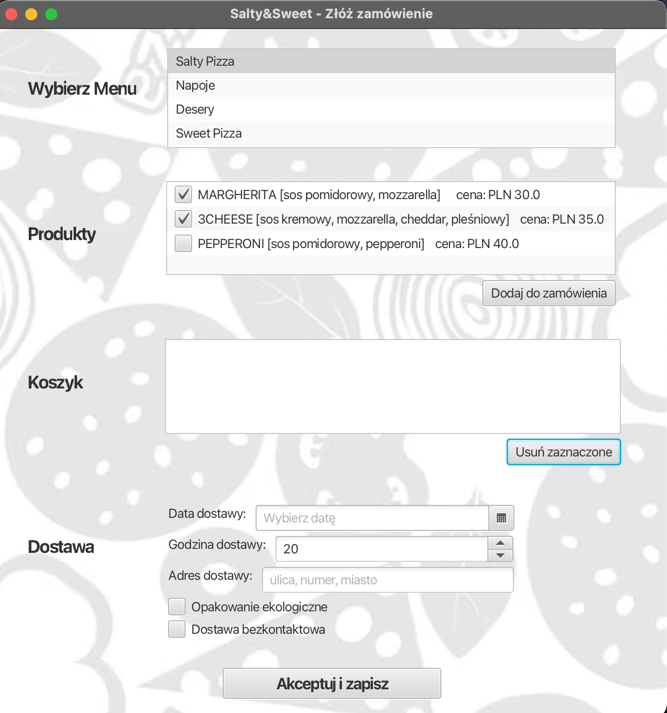

# Pizzeria project

## Description:
Project created as part of the Design and Analysis of Information Systems course.

The system includes an application that allows the display of Menus and Products from the database, selection of order details by the user and saving the Order in the database.

## GUI:

## Techologies:
Java\
Hibernate\
SQLite Database\
JavaFX\
SceneBuilder\
Maven